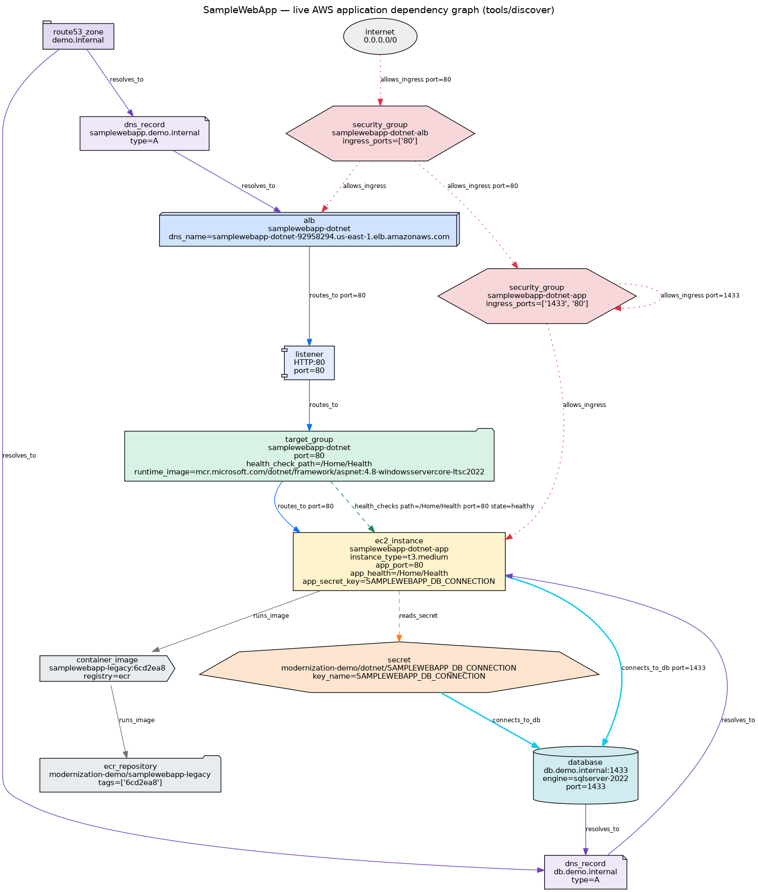
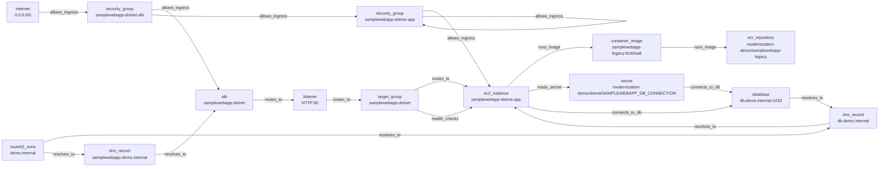

# Live dependency graph — `Project=modernization-demo` `Track=dotnet` (us-east-1)

Generated 2026-09-25T08:18:53+00:00 by `tools/discover/discover.py` from AWS APIs (no agents, read-only).

## Nodes

| type | name | key attributes |
|---|---|---|
| alb | samplewebapp-dotnet | `dns_name=samplewebapp-dotnet-92958294.us-east-1.elb.amazonaws.com` |
| container_image | samplewebapp-legacy:6cd2ea8 | `registry=ecr` |
| database | db.demo.internal:1433 | `engine=sqlserver-2022`, `port=1433` |
| dns_record | db.demo.internal | `type=A` |
| dns_record | samplewebapp.demo.internal | `type=A` |
| ec2_instance | samplewebapp-dotnet-app | `instance_type=t3.medium`, `app_port=80`, `app_health=/Home/Health`, `app_secret_key=SAMPLEWEBAPP_DB_CONNECTION` |
| ecr_repository | modernization-demo/samplewebapp-legacy | `tags=['6cd2ea8']` |
| internet | 0.0.0.0/0 |  |
| listener | HTTP:80 | `port=80` |
| route53_zone | demo.internal |  |
| secret | modernization-demo/dotnet/SAMPLEWEBAPP_DB_CONNECTION | `key_name=SAMPLEWEBAPP_DB_CONNECTION` |
| security_group | samplewebapp-dotnet-alb | `ingress_ports=['80']` |
| security_group | samplewebapp-dotnet-app | `ingress_ports=['1433', '80']` |
| target_group | samplewebapp-dotnet | `port=80`, `health_check_path=/Home/Health`, `runtime_image=mcr.microsoft.com/dotnet/framework/aspnet:4.8-windowsservercore-ltsc2022` |

## Edges

| source | edge | target | detail |
|---|---|---|---|
| samplewebapp-dotnet-alb | `allows_ingress` | samplewebapp-dotnet | scope=attached |
| samplewebapp-dotnet | `routes_to` | HTTP:80 | port=80 |
| HTTP:80 | `routes_to` | samplewebapp-dotnet |  |
| samplewebapp-dotnet | `routes_to` | samplewebapp-dotnet-app | port=80 |
| samplewebapp-dotnet | `health_checks` | samplewebapp-dotnet-app | path=/Home/Health, port=80, state=healthy |
| samplewebapp-dotnet-app | `allows_ingress` | samplewebapp-dotnet-app | scope=attached |
| samplewebapp-dotnet-app | `runs_image` | samplewebapp-legacy:6cd2ea8 |  |
| samplewebapp-legacy:6cd2ea8 | `runs_image` | modernization-demo/samplewebapp-legacy | relation=stored_in |
| samplewebapp-dotnet-app | `reads_secret` | modernization-demo/dotnet/SAMPLEWEBAPP_DB_CONNECTION | via=samplewebapp-dotnet-app/samplewebapp-dotnet-app |
| samplewebapp-dotnet-alb | `allows_ingress` | samplewebapp-dotnet-app | port=80, protocol=tcp, description=legacy app port (IIS) from ALB |
| samplewebapp-dotnet-app | `allows_ingress` | samplewebapp-dotnet-app | port=1433, protocol=tcp, description=sqlserver from app tier (host-local db container) |
| 0.0.0.0/0 | `allows_ingress` | samplewebapp-dotnet-alb | port=80, protocol=tcp |
| demo.internal | `resolves_to` | db.demo.internal | relation=contains |
| db.demo.internal | `resolves_to` | samplewebapp-dotnet-app |  |
| demo.internal | `resolves_to` | samplewebapp.demo.internal | relation=contains |
| samplewebapp.demo.internal | `resolves_to` | samplewebapp-dotnet |  |
| modernization-demo/dotnet/SAMPLEWEBAPP_DB_CONNECTION | `connects_to_db` | db.demo.internal:1433 | via=connection string |
| db.demo.internal:1433 | `resolves_to` | db.demo.internal |  |
| samplewebapp-dotnet-app | `connects_to_db` | db.demo.internal:1433 | port=1433, via=SAMPLEWEBAPP_DB_CONNECTION |

## Mermaid

