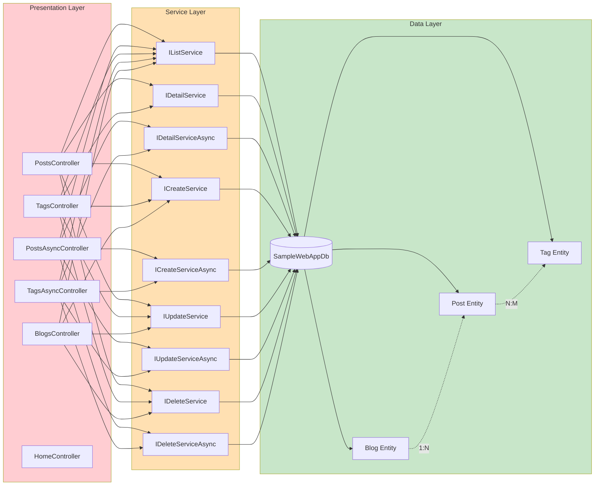
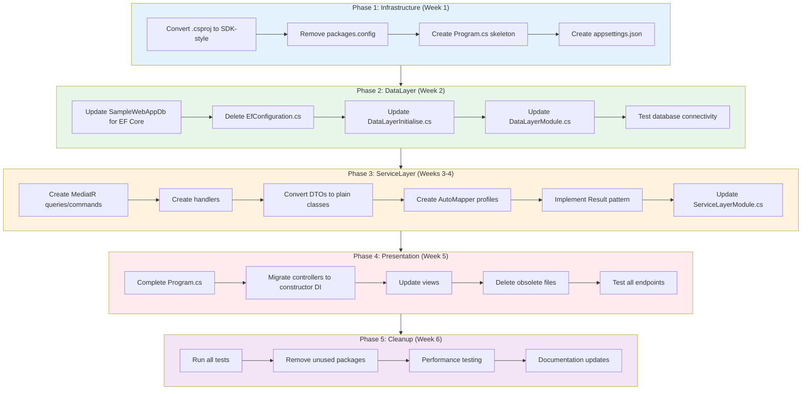
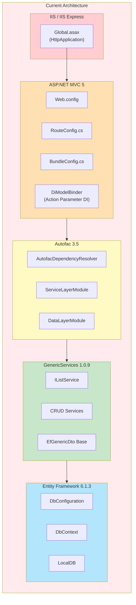
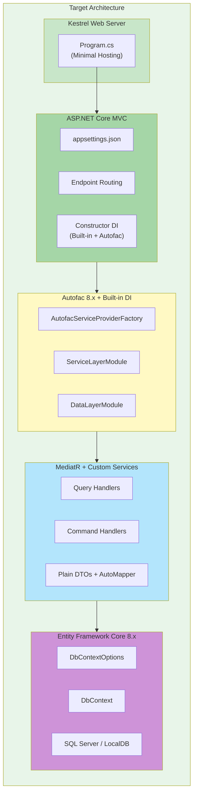
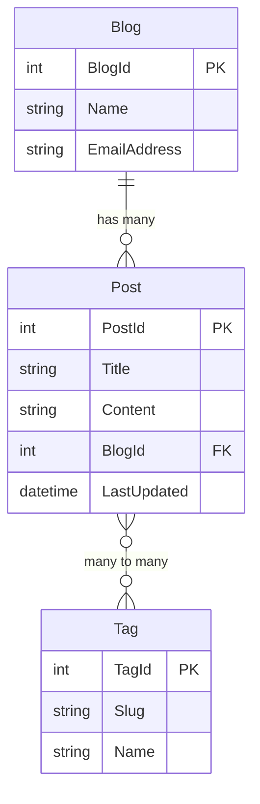
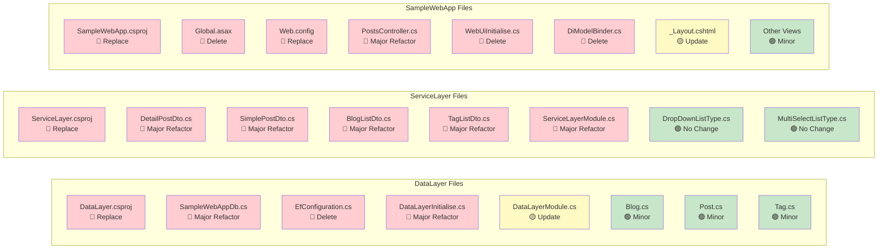

# Migration Boundary Diagram

## Application Architecture Overview

The following diagram illustrates the three-layer architecture of the SampleMvcWebApp application, showing dependencies between layers, external dependencies for each layer, and the proposed migration order.

```mermaid
flowchart TB
    subgraph Legend["Legend"]
        direction LR
        L1[" "] --> L2["Migration Order"]
        style L1 fill:#e8f5e9
        style L2 fill:#fff
    end

    subgraph Phase4["Phase 4: Presentation Layer Migration (Week 5)"]
        direction TB
        subgraph SampleWebApp["SampleWebApp (Presentation Layer)"]
            direction TB
            Controllers["Controllers<br/>- HomeController<br/>- PostsController<br/>- PostsAsyncController<br/>- TagsController<br/>- TagsAsyncController<br/>- BlogsController"]
            Views["Views<br/>- Razor Views (.cshtml)<br/>- _Layout.cshtml<br/>- EditorTemplates"]
            Infrastructure["Infrastructure<br/>- WebUiInitialise<br/>- AutofacDi<br/>- DiModelBinder<br/>- ValidationHelper"]
            AppStart["App_Start<br/>- RouteConfig<br/>- BundleConfig<br/>- FilterConfig"]
            Config["Configuration<br/>- Web.config<br/>- Global.asax"]
        end
    end

    subgraph Phase3["Phase 3: Service Layer Migration (Weeks 3-4)"]
        direction TB
        subgraph ServiceLayer["ServiceLayer (Business Logic)"]
            direction TB
            DTOs["DTOs<br/>- DetailPostDto<br/>- SimplePostDto<br/>- BlogListDto<br/>- TagListDto"]
            UiClasses["UI Classes<br/>- DropDownListType<br/>- MultiSelectListType"]
            ServiceStartup["Startup<br/>- ServiceLayerModule<br/>- ServiceLayerInitialise"]
        end
    end

    subgraph Phase2["Phase 2: Data Layer Migration (Week 2)"]
        direction TB
        subgraph DataLayer["DataLayer (Data Access)"]
            direction TB
            Entities["Entities<br/>- Blog<br/>- Post<br/>- Tag<br/>- TrackUpdate"]
            DbContext["DbContext<br/>- SampleWebAppDb"]
            DataConfig["Configuration<br/>- EfConfiguration"]
            DataStartup["Startup<br/>- DataLayerModule<br/>- DataLayerInitialise"]
        end
    end

    subgraph ExternalDeps["External Dependencies"]
        direction TB
        subgraph WebDeps["SampleWebApp Dependencies"]
            ASPNETMVC["ASP.NET MVC 5.2.3"]
            AutofacMvc["Autofac.Mvc5 3.3.1"]
            Identity["ASP.NET Identity 2.1.0"]
            SignalR["SignalR 2.0.3"]
            OWIN["OWIN 3.0.0"]
            Log4Net["log4net 2.0.3"]
        end
        
        subgraph ServiceDeps["ServiceLayer Dependencies"]
            GenericServices["GenericServices 1.0.9"]
            GenericLibsBase["GenericLibsBase 1.0.1"]
            AutoMapper["AutoMapper 4.2.1"]
            Autofac["Autofac 3.5.0"]
        end
        
        subgraph DataDeps["DataLayer Dependencies"]
            EF6["Entity Framework 6.1.3"]
            DelegateDecompiler["DelegateDecompiler 0.18.0"]
        end
    end

    %% Layer Dependencies
    SampleWebApp --> ServiceLayer
    SampleWebApp --> DataLayer
    ServiceLayer --> DataLayer

    %% External Dependencies
    Controllers --> ASPNETMVC
    Infrastructure --> AutofacMvc
    Infrastructure --> OWIN
    Infrastructure --> Log4Net
    Config --> Identity
    Config --> SignalR

    DTOs --> GenericServices
    DTOs --> GenericLibsBase
    DTOs --> AutoMapper
    ServiceStartup --> Autofac

    DbContext --> EF6
    DataConfig --> EF6
    Entities --> DelegateDecompiler
    DataStartup --> Autofac

    %% Styling
    style Phase4 fill:#ffebee,stroke:#c62828
    style Phase3 fill:#fff3e0,stroke:#ef6c00
    style Phase2 fill:#e8f5e9,stroke:#2e7d32
    style SampleWebApp fill:#ffcdd2
    style ServiceLayer fill:#ffe0b2
    style DataLayer fill:#c8e6c9
    style ExternalDeps fill:#e3f2fd,stroke:#1565c0
```

## Detailed Layer Dependency Diagram

## Migration Flow Diagram

## Current vs Target Architecture

### Current Architecture (.NET Framework 4.5.1)

### Target Architecture (.NET Core 6+)

## Entity Relationship Diagram

## File Migration Status Matrix

### Legend
- 🔴 **Red**: High priority - Major changes or deletion required
- 🟡 **Yellow**: Medium priority - Updates needed
- 🟢 **Green**: Low priority - Minor or no changes

## Summary

The migration follows a bottom-up approach, starting with the DataLayer (lowest risk, no upstream dependencies), then ServiceLayer (highest complexity due to GenericServices replacement), and finally the Presentation Layer (depends on both lower layers).

This phased approach allows for:
1. Incremental testing at each phase
2. Rollback capability if issues arise
3. Clear milestones for progress tracking
4. Isolation of high-risk changes (GenericServices replacement)
